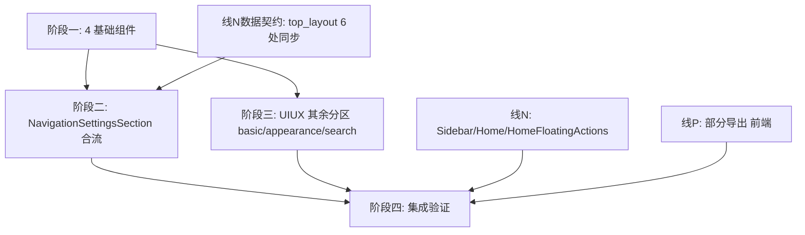

# 开发任务规划：设置页 UI/UX 改造 + 顶部导航增强 + 部分导出备份

> **状态：已完成，集成验收通过。**
>
> - 来源需求：
>   - `docs/plans/SETTINGS_UI_UX_ADJUSTMENT_REQUIREMENTS.md`（设置页 UI/UX 改造，简称 **UIUX**）
>   - `docs/plans/PARTIAL_EXPORT_AND_TOP_NAV_WRAP_REQUIREMENTS.md`（部分导出 A / 顶部分行 B / 右上角对齐 C，简称 **NAV**）
> - 本文只做任务拆分、依赖、顺序、文件所有权与验收；不含实现代码。
> - 需求决策与行号证据以两份需求文档为准；本文不复述，只引用 FR 编号。
> - 冲突裁决以 UIUX §9 为准：`NavigationSettingsSection.svelte` 是唯一硬冲突文件。

---

## 0. 总览

### 0.1 三条业务线

| 线 | 内容 | 来源 | 是否改后端 |
| --- | --- | --- | --- |
| **线 P（部分导出）** | 备份面板按分类勾选导出 | NAV 需求 A | 否（纯前端） |
| **线 N（顶部导航）** | 分行显示 `top_layout` + 右上角按钮对齐 | NAV 需求 B/C | 是（`settings` JSON 增字段，非表结构） |
| **线 U（设置页 UI/UX）** | 4 基础组件 + 6 分区控件/文案/联动改造 | UIUX 全文 | 否（不改数据契约） |

### 0.2 依赖关系（有向无环）

- **阶段一（基础组件）是最大前置**：线 U 全部、线 N 的 `top_layout` 控件都依赖它。
- **线 N 数据契约（`top_layout` 6 处同步）** 独立、可与阶段一并行，是阶段二的前置。
- **合流点只有一个文件**：`NavigationSettingsSection.svelte`（阶段二，单人串行）。
- **线 P** 与线 N 的 `Sidebar/Home/HomeFloatingActions`、线 U 其余分区 **互不碰同一文件**，可全程并行。

### 0.3 文件所有权总表（防止并行踩踏）

| 文件 | 归属任务 | 说明 |
| --- | --- | --- |
| `src/components/ui/Switch.svelte`（新建） | T1 | 基础组件 |
| `src/components/ui/Tooltip.svelte`（新建） | T1 | 基础组件 |
| `src/components/ui/InputGroup.svelte`（新建） | T1 | 基础组件 |
| `src/components/ui/Slider.svelte`（新建） | T1 | 基础组件（名称最终以实现约定为准） |
| `shared/types.ts` `NavigationSetting` | T2-data | 加 `top_layout` |
| `shared/settings.ts` / `schema.sql` / `worker/lib/settingsData.ts` / `src/lib/settingsForm.ts` | T2-data | `top_layout` 同步 6 处 |
| `src/components/settings/NavigationSettingsSection.svelte` | **T3（合流，单人）** | 既有控件改造 + `top_layout` 控件 |
| `src/components/Sidebar.svelte` | T4-nav | 分行 CSS + 交互 |
| `src/views/Home.svelte` | T4-nav | 顶部留白联动 |
| `src/components/HomeFloatingActions.svelte` | T5-align | 右上角对齐 + z-index |
| `src/components/settings/BasicSettingsSection.svelte` | T6-basic | UIUX A |
| `src/components/settings/HeroSettingsSection.svelte` | T6-basic | UIUX A + FR-A10 联动 |
| `src/components/settings/BackgroundSettingsSection.svelte` / `GradientPresetSelector.svelte` | T7-appearance | UIUX B 配色 |
| `src/components/settings/CardSettingsSection.svelte` | T7-appearance | UIUX B 卡片 |
| `src/components/settings/AdvancedSettingsSection.svelte` / `ThemeBackgroundCard.svelte` | T7-appearance | UIUX B 高级 + 浅深 Tab |
| `src/components/settings/SearchEngineSettingsSection.svelte` | T8-search | UIUX D |
| `src/components/settings/settingsSections.css` | T1 建基线，各分区任务追加 | 公共样式；改动需小心并行冲突（见 §5） |
| `src/components/BackupPanel.svelte` / `src/lib/appImportExport.ts` / `src/lib/appBackup.ts` / `src/App.svelte`（导出回调段） | T9-export | 线 P |

---

## 1. 阶段一（T1）：基础组件库

> 依赖：无。产物是后续所有 UI 任务的前置。**必须最先完成并独立验证。**

### T1.1 Switch 组件（UIUX FR-0.1）
- 新建可访问行内开关：`role="switch"` / `aria-checked`、键盘（Space/Enter）可操作、`disabled` 态。
- API：`checked`（`bind`）、`disabled`、`label`（或 slot）、可选 `tooltip` slot/prop。
- 视觉紧凑，替代旧 `.toggle-field` 大卡片；样式基线并入 `settingsSections.css` 或组件内 scoped。

### T1.2 Tooltip 组件（UIUX FR-0.2，OQ-C 方案 1）
- `(?)` 图标为 `button`；桌面 hover + 键盘聚焦触发；移动端触屏**点按切换（Tap to toggle）**。
- `aria-expanded` 表达展开态；同一时刻仅一个 Tooltip 展开（全局互斥）；点浮层外区域关闭。
- 复用 `bookmarkCardTooltip.css` 的显示时机策略思路，但独立为通用组件。

### T1.3 InputGroup 组件（UIUX FR-0.3）
- 数值/文本 + 后缀（单位或操作按钮）一体化输入组。
- 支持常驻单位后缀（`px`/`%`）与「输入框内部后缀按钮」（Input Suffix Button）。
- 取代分散的 `.inline-input` + 外置按钮写法。

### T1.4 Slider 组件（UIUX FR-0.4）
- range 封装，数值显示在滑块**右侧**；内置格式化：`N px`、`N%`、`0` → `0 (隐藏)`/`已禁用`。
- 迁移现有 label 内 `<em>` 数值逻辑。

### T1.5 组件测试（UIUX §9.4）
- 单元/组件测试：受控值双向绑定、`disabled`、键盘可访问性、Tooltip 互斥与关闭、Slider 格式化。

**T1 验收**：4 组件可独立渲染并通过组件测试；不接入任何分区即可运行；`bind` 值流与原生控件等价。

---

## 2. 线 N 数据契约（T2-data）：`top_layout` 字段

> 依赖：无。可与 T1 并行。是 T3 的前置。归 NAV §3.4 所有。

### T2-data 任务
- `shared/types.ts:116-119` `NavigationSetting` 增 `top_layout: 'scroll' | 'wrap'`。
- 同步 6 处（NAV §3.4）：
  1. `shared/types.ts`（类型）
  2. `shared/settings.ts`（key 白名单 / 公开设置透传）
  3. `schema.sql:80-82`（默认值 `'scroll'`）
  4. `worker/lib/settingsData.ts:67-70,110-122`（`DEFAULT_SETTINGS` + `isValidNavigationSetting` 接受新字段、非法值回退）
  5. `src/lib/settingsForm.ts:233-236`（表单默认/归一化，旧数据无字段降级 `'scroll'`）
  6. `NavigationSettingsSection.svelte` UI —— **此处不在 T2-data，归 T3**（避免与 T3 抢文件）
- 单元测试：`isValidNavigationSetting` 接受 `top_layout`、非法值回退默认（NAV §4.3）。

**T2-data 验收**：旧设置数据（无 `top_layout`）读入后归一化为 `'scroll'`；后端校验对非法值回退默认；类型编译通过。**本任务不改 UI，不动 `NavigationSettingsSection.svelte`。**

---

## 3. 阶段二（T3）：`NavigationSettingsSection.svelte` 合流（唯一硬冲突）

> 依赖：T1（Switch/Tooltip/InputGroup）+ T2-data（`top_layout` 字段）。
> **必须单人串行改这一个文件**，一次性落地两份需求的改动。裁决见 UIUX §9.1 / §9.3。

### T3 任务（同一 fieldset 内）
- **既有控件改造（UIUX 线 U，FR-C1~C5）**：
  - FR-C1 分类导航位置：保持 segmented，说明转 Tooltip。
  - FR-C2 左侧导航始终展开：checkbox → **Switch**，说明转 Tooltip，保留 `position!=='left'` 置灰。
  - FR-C3 内容区域最大宽度：number + 单位 → **InputGroup**，说明转 Tooltip。
  - FR-C4 桌面左右边距：range → **Slider**（右侧 `N px`），与顶/底边距整合 3 列子网格。
  - FR-C5 顶部/底部边距：range → **Slider**（右侧 `N%`）。
- **新增 `top_layout` 控件（NAV 线 N，FR-B1/§3.3）**：
  - 用 **Switch 或 segmented 组件**（不用旧 `.toggle-field` checkbox），「横向滚动 / 分行显示」，默认 `scroll`。
  - 仅 `position='top'` 可用（否则置灰），与「始终展开（仅 left）」按 `position` **互斥启用**。
  - 说明「分行仅桌面生效、移动端仍横向滑动」用 **Tooltip** 承载。
- **互斥布局**：在「分类导航位置」下方，left 时启用「始终展开」、top 时启用「分行显示」，另一者置灰；置灰须保数据值不丢。

**T3 验收**：
- 布局与导航分区所有控件为新组件形态；说明均为 Tooltip。
- `top_layout` 切换驱动 `bind:form` → 预览/`isDirty`/`canSave` 正常。
- 切 `position` 时「始终展开」「分行显示」正确互斥置灰，数据值不丢。

---

## 4. 线 N 视图层（可并行，不碰设置组件）

> 依赖：T2-data（读 `top_layout`）。与 T3、T6~T9 并行（不同文件）。

### T4-nav：顶部分行渲染（NAV 需求 B，`Sidebar.svelte` + `Home.svelte`）
- FR-B2 桌面/宽屏 `.top-track` 允许 `flex-wrap:wrap`，高度自适应（改固定 52px）。
- FR-B3 桌面分行下隐藏/禁用滚动箭头与指针拖拽。
- FR-B5 `Home.svelte` 顶部留白随导航高度联动（`top-navigation-layout`）。
- FR-B6 `.top-submenu` 弹出锚点在多行下重新校准、不溢出。
- FR-B7 移动端断点（`@media max-width:799px`）强制 `nowrap`+固定 48px，覆盖桌面分行样式（硬约束）。
- 门控：仅当 `top_layout==='wrap'` 且桌面/宽屏时启用分行。

**T4 验收（NAV AC-B2~B8）**：桌面 wrap 换行、无横滚、箭头隐藏、子菜单锚定正确、内容不被遮挡；移动端不换行、48px、横向滑动、不占整屏。

### T5-align：右上角按钮对齐（NAV 需求 C，`HomeFloatingActions.svelte`）
- FR-C1/C2 顶部模式 `.floating-actions` 与 52px 导航栏同高对齐（改现 `4.75rem` 下压）。
- FR-C3/OQ-C2 宽视口重叠 → 悬浮方案：`.floating-actions` z-index 提到 `.top-navigation`（60）之上。
- FR-C4 仅顶部模式生效；左侧模式位置无回归。
- FR-C5/OQ-C1 分行多行时按钮对齐导航栏**首行顶部**，不随行数下移。
- FR-C6 移动端与 48px 导航同高、不遮挡搜索框、不压缩可滑动区。

**T5 验收（NAV AC-C1~C6）**：桌面同高无遮挡、分行首行稳定、移动端对齐、左侧模式无回归。

> T4 与 T5 有视觉耦合（分行高度影响按钮对齐基准），**建议同一人接手线 N 视图层**，或 T5 在 T4 完成后校准；两者不改同一文件，可并行编码但需联合验证。

---

## 5. 阶段三（T6~T8）：UIUX 其余设置分区（可并行）

> 依赖：T1。彼此文件不重叠，可并行。**注意**：均会向 `settingsSections.css` 追加/调整公共样式——见 §7 冲突缓解。

### T6-basic：站点设置分区（UIUX 需求 A）
- `BasicSettingsSection.svelte`：FR-A1~A7（标题 placeholder、颜色/图床说明转 Tooltip、字号 Slider、公开模式 & 浏览器同步 → Switch + Tooltip、默认主题说明转 Tooltip）。
- `HeroSettingsSection.svelte`：FR-A8（经常访问数 Slider）、FR-A9（三开关 → Switch）、**FR-A10 新增联动**（显示搜索框关闭 → 引擎选择器置灰，值不丢）。

**T6 验收**：控件形态到位；FR-A10 联动正确且置灰保值；预览联动正常。

### T7-appearance：外观与卡片分区（UIUX 需求 B）
- `BackgroundSettingsSection.svelte` / `GradientPresetSelector.svelte`：FR-B1 删顶层说明、FR-B2 方案描述转 hover/Tooltip、精简卡片。
- `CardSettingsSection.svelte`：FR-B3 卡片风格精简、FR-B4 描述策略说明转 Tooltip（**保留现有极简替换交互，OQ-B**）。
- `AdvancedSettingsSection.svelte` + `ThemeBackgroundCard.svelte`：
  - **FR-B6 浅/深背景内部 Tab（核心结构优化）**：两套纵向堆叠 → `[浅色|深色]` Tab，切 Tab 不丢值，与 `previewTheme` 协调。
  - FR-B7 背景类型删说明；FR-B8 图床上传做 InputGroup 内部后缀按钮；FR-B9/B15 遮罩/表面色说明转 Tooltip；FR-B10/B11/B16 模糊/透明度/不透明度 → Slider；FR-B12~B14 尺寸 InputGroup 单位后缀 + 保留现有置灰；FR-B17 文字色说明转 placeholder。

**T7 验收**：浅深 Tab 表单高度减半且切换不丢值；各控件形态到位；`card_style` 相关置灰联动无回归；预览联动正常。

### T8-search：搜索设置分区（UIUX 需求 D）
- `SearchEngineSettingsSection.svelte`：FR-D1 删默认引擎说明、FR-D2 名称 placeholder + 列表紧凑化、FR-D3 Favicon.im 改输入内部操作图标（InputGroup 后缀）、FR-D4 查询模板 placeholder、FR-D5 删除按钮 → TrashIcon、FR-D6 新增按钮文案统一「+ 添加搜索引擎」。

**T8 验收**：列表紧凑；删除图标化保留 `engines.length<=1` 禁用；Favicon 抓取内嵌可用；模板校验（含 `{q}`）无回归。

---

## 6. 线 P（T9）：部分导出备份（全程可并行）

> 依赖：无（纯前端，独立文件）。与所有其它任务并行。归 NAV 需求 A。

### T9-export 任务
- `BackupPanel.svelte`：导出区新增两级分类树选择器（三态复选框，父联动子）；`settings` 导出开关默认勾选；「全选/清空」，默认全选；空选择禁止导出。
- `src/lib/appBackup.ts` / `appImportExport.ts`：导出前按选中分类过滤 `categories`/`bookmarks`，**强制补入选中项的一级父分类**（FR-A2 硬约束）；`settings` 开关关时置 `null`；计数消息反映实际导出数。
- `src/App.svelte`（导出回调段 `894-897`）：把选择结果传入导出函数。
- **不新增后端端点、不改 `BackupData`/`ImportReq` 结构**（NAV §2.5）。
- 单元测试（参考 `tests/unit/appBackup.test.ts`）：子集组装 + 必需父分类补全。

**T9 验收（NAV AC-A1~A8）**：子集导出结构合法、往返 replace/merge 成功、默认全选等价全量、空选择拦截、计数准确、无后端改动。

---

## 7. 并行冲突缓解

- **`settingsSections.css` 是软冲突面**：T1 建立组件样式基线后，T3/T6/T7/T8 可能各自追加。缓解：
  - T1 一次性把 Switch/Tooltip/InputGroup/Slider 的公共类写入 `settingsSections.css`；
  - 各分区任务只在**自己的组件 scoped `<style>`** 内做局部布局，尽量不改公共 css；
  - 若必须改公共 css，通过 `hub` 协调、串行提交该文件。
- **唯一硬冲突** `NavigationSettingsSection.svelte` 已隔离到 T3 单人串行。
- 其余文件所有权互斥（§0.3），并行安全。

---

## 8. 推荐执行批次

| 批次 | 并行任务 | 前置 |
| --- | --- | --- |
| **批次 1** | T1（基础组件）、T2-data（`top_layout` 契约）、T9-export（部分导出） | 无 |
| **批次 2** | T3（Nav 合流，单人）、T6-basic、T7-appearance、T8-search、T4-nav、T5-align | T1 完成；T3 另需 T2-data |
| **批次 3** | T-verify（集成验证 §9） | 批次 2 全部完成 |

- 批次 1 内三者完全独立，可并行。
- 批次 2 内 T3 依赖 T1+T2-data；T4/T5 依赖 T2-data；T6/T7/T8 依赖 T1。除 T3 单人锁 `NavigationSettingsSection.svelte` 外互不踩文件。
- T4 与 T5 建议同一人（视觉耦合），联合验证分行高度与按钮对齐基准。

---

## 9. 阶段四（T-verify）：集成验证

> 依赖：全部实现任务。遵循 `AGENTS.md` 的 `real-chrome-cdp-testing` + 专用临时 profile。

### 9.0 验证机制（零确认约束）

**目标：整个开发+测试过程不需要用户任何确认，包括浏览器「允许」按钮。**

- **采用**：自启动的**隔离无头 Chrome + CDP**（沿用 `scripts/chrome-regression.mjs` / `real-chrome-cdp-testing` 模式），针对**本地开发服务器**验证。
  - 专用临时 `--user-data-dir`（名称 `cf-navs-chrome-profile-<id>`）：全新 profile 无扩展、无权限状态 → **不弹权限/允许/调试对话框**；无头运行不抢占用户窗口焦点。
  - 连接返回的 `webSocketDebuggerUrl`，用项目依赖 `ws` 发送 CDP（Node 内置 WebSocket 在本仓库不可靠）。
  - 登录用页面上下文 `fetch('/api/login', …)`，不走 UI 打字（`AGENTS.md`）。
  - 本地请求用 `--noproxy '*'` 绕过 `HTTP(S)_PROXY`（`127.0.0.1:10808`），避免 502。
- **不采用**：
  - **omp browser relay**（驱动用户真实登录 Chrome，需扩展 attach、会归因到用户账号并弹「允许」）——排除。
  - **`computer` 桌面工具**（控制真实桌面、抢焦点）——排除。
- **本地目标而非生产**：起本地 `wrangler` dev + 本地 D1（自建管理员凭据），针对 `http://127.0.0.1:<port>` 验证；**不触碰生产、不需要用户提供生产凭据**。`chrome-regression.mjs` 现指向 `baseUrl`（生产），功能验证时通过 `BASE_URL=http://127.0.0.1:<port>` 覆盖为本地。
- **进程管理**：本地 dev server 与无头 Chrome 都通过 `hub start` 启动为受管进程；验证后仅清理**命令行含该精确临时 profile 路径**的 Chrome，确认进程数为 0 再删临时 profile；失败则如实报告，不谎称已清理。
- **凭据安全**：管理员凭据只经环境变量 `ADMIN_USER`/`ADMIN_PASS` 传入本地验证，不写入文件、源码、文档、截图或提交。

#### 本地验证前置（一次性）

> **会话授权（2026-08-29）**：用户在本次会话中**明确授权**为验证目的启动本地 dev server，覆盖 `AGENTS.md`「不擅自起本地 dev server」的约束。整个开发+测试过程不需要用户任何确认（含浏览器「允许」按钮）。此授权仅限本次会话的本地验证，不含 `git add/commit/push`、部署或生产操作。

- `npm run setup:wrangler`（若需要）→ `npm run db:init`（本地 D1 建表）→ 起 `npm run dev`（wrangler 本地）或视情况 `npm run dev:web`（纯前端，但设置页需 API，故以 wrangler 本地为准）。
- 种子数据：建立至少 2 个一级分类、含二级分类与书签，供部分导出与顶部分行/多行验证。

### 9.1 自动化
- 组件测试：T1 四组件（受控/disabled/键盘/互斥/格式化）。
- 单元测试：`isValidNavigationSetting`(`top_layout`)、部分导出子集+父分类补全。
- 项目检查（一次性，收尾执行）：`npm run type-check`、`npm test`、`npm run build`、`git diff --check`。
- **API 冒烟测试（仓库自带套件，必跑）**：`node scripts/smoke-test.mjs`，以 `BASE_URL` 指向本地 `wrangler dev`、`ADMIN_USER`/`ADMIN_PASS` 走环境变量。覆盖 health、config、登录鉴权（错误密码/无 token/无效 token）、`/api/me`、分类与书签 CRUD+排序、设置读写与非法值拒绝、公开数据聚合、公开模式开关、级联删除、favicon、站点名解析、`/api/import` 校验与越权、登出后 token 失效。
  - **前置硬要求**：脚本首项断言「初始分类列表为空」，必须在**干净本地 D1** 上运行（`rm -rf .wrangler/state/v3/d1` 后 `npm run db:init`），否则残留数据会连锁误报。
- **真实浏览器回归套件（仓库自带，必跑）**：`node scripts/chrome-regression.mjs`（`BASE_URL` 指向本地、`REGRESSION_FORCE_TEMP_CHROME=1` 强制隔离临时 Chrome）。覆盖首页渲染/卡片/图片/主题切换/搜索、后台进入与书签搜索、设置页与备份页渲染、右键编辑弹窗、登出清理、无效 token 与匿名越权、改密使旧会话失效并还原。
  - **前置硬要求**：种子数据必须包含**一级分类的直属书签**；若全部书签只挂在二级分类，`home bookmark cards present` 与右键编辑用例会因首页无卡片而误报失败。

### 9.2 真实浏览器（桌面 + 移动断点）
- **设置页**：逐分区核对控件形态、Tooltip 显示（桌面 hover/焦点、移动点按切换互斥）、联动置灰保值（FR-A10、FR-C2、`top_layout` 互斥）、右侧预览实时更新、保存流程（`isDirty`/`canSave`）。
- **顶部导航**：顶部+分行 → 820px 窗口确认 2 行换行、无横滚、子菜单锚定、内容不遮挡；721/768/799px 断点确认 nowrap、48px、横向滑动、按钮与轨道可视分离；390×844 同样确认不占整屏。
- **右上角按钮**：820px 桌面同高、分行首行对齐、z-index 悬浮；721/768/799/390px 移动断点均与 48px 导航对齐且不覆盖轨道；切左侧模式 top=20px 无回归。
- **部分导出**：分类树清空→勾选子集→实际下载 JSON→replace/merge 重新导入→核对数据一致。
- **本轮结果**：上述场景通过；控制台错误、页面异常、失败请求均为 0。

### 9.2bis 冒烟与回归套件实跑结果（2026-08-30 补跑）

- **`scripts/smoke-test.mjs`（干净本地 D1）**：修正脚本与现行产品契约的两处漂移后，**75 / 75 全部通过**。
  - 分类排序请求按 `CategorySortReq` 向 `/api/categories/sort` 传 `parent_id:null`，正确覆盖顶层完整兄弟集排序。
  - 导入断言按 `remapImportRecords` 的既有语义验证分类从 1 起重编号、原始分类 id 不保留，以及书签 `category_id` 重绑到正确分类。
  - 变异验证：故意反转 `sortCategories` 写入顺序时，`排序后 B 在前` 精确失败；故意破坏书签分类重绑时，`书签 category_id 重绑到正确分类` 精确失败。恢复产品代码后 75 / 75 再次全绿。
- **`scripts/chrome-regression.mjs`（隔离临时 Chrome，`REGRESSION_FORCE_TEMP_CHROME=1`）**：**25 / 25 全部通过**，consoleErrors 0、pageExceptions 0、failedRequests 0（仅含预期的越权探针 401）。覆盖首页渲染/卡片/图片/主题/搜索、后台进入与书签搜索、设置页与备份页渲染、右键编辑弹窗、登出清理、无效 token 与匿名越权、改密使旧会话失效并还原。
  - 首次运行 `home bookmark cards present` 与右键编辑失败，根因是**我的种子数据把书签全挂在二级分类**（一级直属书签为 0），首页因此无卡片；补入一级直属书签后两项转通过——属 fixture 缺陷，非产品回归。
- 套件结束后按精确 profile 校验隔离 Chrome 进程数为 0。

### 9.2ter 设置卡片高度与外层滚动回归修复（2026-08-30）

- `src/components/SettingsPanel.svelte` 桌面高度统一为 `clamp(0px, calc(100dvh - 180px), 960px)`，最小高度统一按同一可用高度计算为 `min(560px, calc(100dvh - 180px))`。
- `180px` 预留后台外层壳体与 `.settings-panel-wrap` 的 `24px` 底部间距；`.settings-section-content` 保持内部 `overflow-y:auto`，≤1320px 恢复自然高度和单列布局。
- `tests/unit/adminSettingsLayout.test.ts` 同时校验设置卡片、内容滚动容器、外层滚动容器和 1320px 响应式覆盖；隔离 headless Chrome 已验证 `1440×1000`、`1321×1000`、`1440×768` 无外层溢出，1320px/移动端保持自然高度。

### 9.3 收尾
- 两份需求文档补「实现提交」与「回归护栏」；本文标记各任务完成。
- 遵循 `AGENTS.md`：默认 `develop`，不擅自 `git add/commit/push`、不部署、不写真实生产域名/凭据。

---

## 10. 范围与红线

- 不改后端表结构；线 N 仅在 `settings` JSON 增 `top_layout`，`schema.sql` 默认值随之更新。
- 线 P 不新增后端端点、不改 `BackupData`/`ImportReq`。
- 线 U 不改设置项数据契约、不动 `footer`/`account` 分区、不改 `SettingsHomePreview` 预览逻辑（仅保事件流）。
- FR-B4 保留现状交互（不改置灰）；FR-A10 为已确认的新增联动。
- 移动端分行为硬禁止（NAV FR-B7）。

---

## 11. 文档同步纪律（强制）

**规则：每完成一轮任务（一个 T 编号或一个批次），必须先更新相关文档，再进入下一轮。禁止连续开发多轮而不回写文档。**

每轮任务收尾时按以下清单更新（缺一不可）：

1. **本文档 §12 进度台账**：把该任务状态从 `未开始` → `进行中` → `已完成`；填入实际改动文件、验证方式与结果、提交/未提交状态。
2. **对应需求文档**：
   - 线 P/N 完成 → `PARTIAL_EXPORT_AND_TOP_NAV_WRAP_REQUIREMENTS.md` 对应 AC 勾选，文首补「实现提交」（若已提交）或「已实现待提交」。
   - 线 U 完成 → `SETTINGS_UI_UX_ADJUSTMENT_REQUIREMENTS.md` 对应 FR/AC 标注完成。
3. **验证证据**：把该轮真实验证（命令、场景、结果、截图路径若有）记入 §12 台账对应行；未验证项如实标注，不得留空当已完成。
4. **偏差回写**：实现中若与需求文档不符（行号漂移、方案调整、发现的新约束），先改需求文档再改代码，保持文档与源码一致（`AGENTS.md` 重构验证约定）。
5. **收尾轮**：全部完成后更新 `docs/reference/PROJECT_OVERVIEW.md` 维护待办（如涉及）、`CHANGELOG.md`，并在 §12 标记整体完成。

> 文档更新与代码改动属同一轮工作，不拆分到「以后统一补」。一轮 = 实现 + 自验证 + 文档回写。

---

## 12. 进度台账（每轮更新）

> 状态取值：`未开始` / `进行中` / `已完成` / `阻塞`。每轮结束由执行者更新本表与「验证结果」列。

| 任务 | 批次 | 状态 | 实际改动文件 | 验证方式与结果 | 备注 |
| --- | --- | --- | --- | --- | --- |
| T1 基础组件 | 1 | 已完成 | `src/components/ui/Switch.svelte`、`Tooltip.svelte`、`InputGroup.svelte`、`Slider.svelte`（新建）、`src/lib/sliderFormat.ts`、`src/lib/tooltipStore.ts`（新建） | `npx vitest run tests/unit/sliderFormat.test.ts tests/unit/uiComponents.test.ts` → 15 passed；`svelte-check` 0 error | Tooltip 全局互斥 + aria-describedby；Switch/InputGroup/Slider 支持 Svelte 同名 bind 事件 |
| T2-data `top_layout` 契约 | 1 | 已完成 | `shared/types.ts`、`schema.sql`、`worker/lib/settingsData.ts`、`src/lib/settingsForm.ts`、`tests/unit/settingsData.test.ts` | `npx vitest run tests/unit/settingsData.test.ts` → 8 passed；旧数据缺字段降级 scroll 且保 position/always_expanded | `shared/settings.ts` 无需改（navigation 整体透传）；Sidebar/Home 默认值已补 `top_layout:'scroll'` |
| T9-export 部分导出 | 1 | 已完成 | `src/lib/appBackup.ts`（`selectBackupSubset`）、`src/lib/appImportExport.ts`、`src/components/BackupPanel.svelte`、`src/App.svelte`、`src/views/Admin.svelte`、`src/components/admin/AdminTabContent.svelte`、`tests/unit/appBackup.test.ts` | `npx vitest run tests/unit/appBackup.test.ts` → 6 passed；真实浏览器实际下载 3 分类/6 书签/settings=true，replace+merge code=0 | 三态分类树+默认全选+settings 默认勾选+空选禁用；FR-A2 强制补父分类；未新增后端端点 |
| T3 Nav 合流（单人锁文件） | 2 | 已完成 | `src/components/settings/NavigationSettingsSection.svelte` | `svelte-check` 0 error；真实浏览器 position 互斥置灰 | 位置说明转 Tooltip；始终展开/分行显示双 Switch 按 position 互斥；最大宽度 InputGroup；边距 Slider |
| T4-nav 分行渲染 | 2 | 已完成 | `src/components/Sidebar.svelte`、`src/views/Home.svelte` | 真实 CDP：820px 桌面分行 2 行/98px、箭头隐藏、子菜单在视口内；390×844 nowrap/48px/横向滚动；可视按钮重叠 0；无 console/page/request 错误 | `isWrap` 桌面门控；移动端轨道宽 228px，预留右上角按钮区 |
| T5-align 右上角对齐 | 2 | 已完成 | `src/components/HomeFloatingActions.svelte` | 真实 CDP：桌面 top=18/nav top=12、z-index=70；移动 top=14/nav top=8；左侧模式 top=20px（原 1.25rem）；无 console/page/request 错误 | 顶部模式首行对齐；z-index 50→70 悬浮于导航栏上；移动端不覆盖轨道 |
| T6-basic 站点设置分区 | 2 | 已完成 | `src/components/settings/BasicSettingsSection.svelte`、`HeroSettingsSection.svelte` | 真实 CDP：6 个设置菜单正常；Switch/Tooltip/Slider 渲染；FR-A10 关闭搜索框后引擎选择器 Disabled；无 page 错误 | 标题 placeholder+必填星；颜色/图床/主题说明转 Tooltip；字号/经常访问数 Slider；公开模式/浏览器同步/三显示开关改 Switch |
| T7-appearance 外观分区 | 2 | 已完成 | `BackgroundSettingsSection.svelte`、`GradientPresetSelector.svelte`、`CardSettingsSection.svelte`、`AdvancedSettingsSection.svelte`、`ThemeBackgroundCard.svelte` | `svelte-check` 0 error；全量 649 passed | 浅/深背景改 segmented Tab（不丢值）；模糊/透明度/不透明度 Slider；尺寸 InputGroup+px；表面/遮罩/描述策略说明转 Tooltip；FR-B4 保留极简替换交互；配色卡片精简 |
| T8-search 搜索分区 | 2 | 已完成 | `src/components/settings/SearchEngineSettingsSection.svelte` | `svelte-check` 0 error；全量 649 passed；真实 CDP 搜索分区渲染无页面异常 | 默认引擎删说明；名称/图标 placeholder；Favicon.im 改 InputGroup 内嵌图标按钮；删除改垃圾桶图标（保留单条禁用）；新增文案「+ 添加搜索引擎」 |
| T-verify 集成验证 | 3 | 已完成 | `.claude/tmp/verify-*.mjs`、`run-smoke.mjs`、`run-regression.mjs`（本地临时，不入库）、需求文档证据 | `npm run type-check` 通过；`npx vitest run` 95 files/649 passed；`npm run build` 成功；`git diff --check` 通过；**`scripts/smoke-test.mjs` 75/75 全绿**；**`scripts/chrome-regression.mjs` 25/25 全绿**；CDP 桌面/移动断点、设置、导出、子菜单、左侧回归通过；Reviewer PASS | 第一轮断点问题已修复；仓库自带冒烟与回归套件已纳入固定验证；文档台账与需求状态已同步 |
| 收尾（CHANGELOG/OVERVIEW） | 3 | 已完成 | `CHANGELOG.md`；相关需求/任务文档 | 变更记录已补充；`PROJECT_OVERVIEW.md` 既有维护待办未涉及，不修改 | 本轮无 git/部署/生产操作 |
| 设置卡片高度与滚动边界 | 3 | 已完成 | `src/components/SettingsPanel.svelte`、`src/components/admin/AdminTabContent.svelte`、`tests/unit/adminSettingsLayout.test.ts` | `adminSettingsLayout.test.ts` 14 passed；`npm run type-check` 0 errors / 0 warnings；隔离 headless Chrome 验证宽屏无外层溢出、1320px/移动端自然高度；`git diff --check` 通过 | 桌面高度扣除外层预留与 wrapper 24px 间距；内容在 section 内滚动，≤1320px 不保留固定高度 |

> **数值证据的性质（2026-09-04 定性，PROB-16）**：本表与下方轮次记录里的数值断点证据是**一次性人工 CDP 证据，不构成持续回归**。具体指：`T9-export` 行的「实际下载 3 分类/6 书签、replace+merge `code=0`」；`T4-nav` 行与「集成验收修正（第二轮）」的「820px 桌面分行 2 行/98px、箭头隐藏、子菜单在视口内」；`T5-align` 行的「桌面 top=18 / nav top=12 / z-index=70，移动 top=14 / nav top=8」；以及 `721px / 768px / 799px` 中间断点复验。
>
> 可复跑闸门实际覆盖的是别的东西：`scripts/chrome-regression.mjs` 的 25 条断言只到「设置页/备份页已渲染、控件存在」这一层（见 `scripts/chrome-regression.mjs` 的 `collectChecks`），没有数值型断点、`getComputedStyle` 采样、视口仿真或下载/导入自动化；`scripts/smoke-test.mjs` 覆盖的是 API 端到端，不含布局数值。
>
> 未把这些数值补进 `scripts/chrome-regression.mjs`，原因是它需要的前置条件本轮不具备且不被授权：脚本必须有可达的 `BASE_URL`（环境变量或被忽略的 `verify.local.json`）、真实管理员凭据，并且它的安全场景会真实改写再还原管理员密码；补数值断言还需要额外引入视口仿真、确定性分类/书签 fixture 与下载断言。`AGENTS.md` 规定未经明确要求不启动本地服务、不部署，因此这些断点只能在显式授权的部署后验收里复跑（并入 PROB-13）。回归套件本身未改动。

- **2026-08-30 补跑仓库自带冒烟与回归套件（验证遗漏修补）**
  - 发现遗漏：前几轮只跑了 `vitest` + `type-check` + `build` + 自写 CDP 场景脚本，**未运行仓库自带的 `scripts/smoke-test.mjs`（API 端到端冒烟）与 `scripts/chrome-regression.mjs`（真实浏览器回归套件）**，四份文档也未提及。已补跑并在 §9.1 / §9.2bis 固化为必跑项。
  - `smoke-test.mjs`（干净本地 D1）最初为 70 / 73；随后修正脚本与 PR #7 分类排序契约、`remapImportRecords` 导入重编号语义的漂移，最终 **75 / 75 全绿**。两处新断言均经故障注入证明能抓住对应回归。
  - `chrome-regression.mjs`（隔离临时 Chrome）：25 / 25 全部通过，consoleErrors/pageExceptions/failedRequests 全 0；套件结束按精确 profile 校验 Chrome 进程归零。
  - 修正自身 fixture 缺陷：原种子数据全部书签只挂二级分类导致首页无卡片，误报 2 项失败；补入一级直属书签后转为全绿。
- **2026-08-30 最终复核通过**：按 Reviewer 意见统一文档状态横幅、补齐 T8-search 台账行；最终 Reviewer PASS。三份文档状态均为「已完成，集成验收通过」，T1~T8/T-verify/收尾台账完整。
- **2026-08-30 集成验收修正（第二轮）**
  - Reviewer 发现 721–799px 中间断点仍使用桌面按钮尺寸/留白；已将 `Home.svelte` 与 `HomeFloatingActions.svelte` 相关移动覆盖统一到 `max-width:799px`，并保留 Sidebar 移动端轨道与按钮区隔离。
  - 在 721px / 768px / 799px 真实视口复验：nowrap、48px、overflow-x:auto、按钮 top=14/nav top=8、可视重叠 0；820px desktop wrap 2 行/98px与子菜单定位仍通过。
  - `npm run type-check` 通过；`npx vitest run` 95 files / 649 passed；`npm run build` 成功；`git diff --check` 通过。
  - Reviewer 第一轮结论：CHANGES_REQUIRED（已按意见修复，待二次复核）。
- **2026-08-30 集成验收修正**
  - 移动端顶部导航增加实际轨道宽度预留（`Sidebar.svelte`）：按钮区与横向可滚动分类区分离，390×844 可视重叠 0；仍保持 nowrap / 48px / overflow-x:auto。
  - 基础组件补齐 Svelte `bind` 同名事件（`checked` / `value`），Tooltip 补 `aria-describedby` 与浮层 id；更新对应组件契约测试。
  - 真实浏览器补验：820px 桌面 2 行/98px、分行子菜单定位；390×844 移动端单行/48px/按钮区分离；备份实际下载 3 分类/6 书签，replace+merge code=0；左侧模式按钮 top=20px。
  - 当前自动化证据：`npm run type-check` 通过；`npx vitest run` 95 files / 649 passed；`npm run build` 成功；`git diff --check` 通过。
  - T3：`NavigationSettingsSection.svelte` 合流——位置说明转 Tooltip；「始终展开」「分行显示」双 Switch 按 `position` 互斥启用；最大宽度 InputGroup、边距 Slider。
  - T4：`Sidebar.svelte` 分行渲染（`isWrap` 桌面门控、`.top-track.wrap` flex-wrap、箭头/拖拽禁用、移动端断点强制单行）；`Home.svelte` 用顶部导航高度回调驱动 `--top-nav-padding`（移动端固定 4.5rem）。
  - T5：`HomeFloatingActions.svelte` 顶部模式按钮对齐导航栏首行（桌面 1.125rem/移动 0.85rem），z-index 50→70 悬浮于导航栏之上。
  - T6：`BasicSettingsSection`/`HeroSettingsSection` 全部改 Switch/Slider/Tooltip；新增 FR-A10「显示搜索框关→引擎选择器置灰」联动（置灰保值）。
  - T7：外观分区 5 文件——浅/深背景 segmented Tab（切换不丢值）、Slider/InputGroup/Tooltip 改造、保留 card_style 置灰与 FR-B4 极简替换交互。
  - T8：搜索分区——Favicon.im 内嵌为 InputGroup 后缀图标按钮、删除改垃圾桶图标、文案统一。
  - 集成修复：4 基础组件 transition 去掉硬编码时长回退（改用 `var(--transition-base)`）以过 designTokens 契约；同步更新 `settingsForm.test.ts`/`adminSettingsLayout.test.ts`/`adminBackupLayout.test.ts` 中因控件形态变化的断言（Switch/Slider/InputGroup、top_layout 字段、背景 Tab 顺序、favicon 内嵌）。
  - 全量 `svelte-check` 0 error；`npx vitest run` 全量 648 passed（95 文件）。未运行 git/部署。**截至当时**真实浏览器验证留待批次 3 T-verify，后续已在 §9.2bis 补跑并通过。
- **2026-08-29 批次 1 完成（T1 + T2-data + T9-export）**
  - T1：新建 4 个基础组件（`src/components/ui/` 下 Switch/Tooltip/InputGroup/Slider）+ 格式化助手 `src/lib/sliderFormat.ts` + 互斥 store `src/lib/tooltipStore.ts`；新增 `tests/unit/sliderFormat.test.ts`、`tests/unit/uiComponents.test.ts`（14 passed）。
  - T2-data：`NavigationSetting` 增 `top_layout: 'scroll'|'wrap'`，同步 `shared/types.ts`/`schema.sql`/`worker/lib/settingsData.ts`/`src/lib/settingsForm.ts`；`settingsData.test.ts` 8 passed。集成修正：`Sidebar.svelte`/`Home.svelte` 默认 navigation 字面量补 `top_layout:'scroll'`。
  - T9-export：`selectBackupSubset` 按分类子集导出并强制补父分类；`BackupPanel.svelte` 加三态分类树/settings 开关/全选清空/默认全选/空选禁用；接线经 `Admin.svelte`→`AdminTabContent.svelte`→`App.svelte`；`appBackup.test.ts` 6 passed。
  - 修复：子代理误删 `src/App.svelte` 的 `api/getErrorMessage/isUnauthorizedError` import，已恢复。
  - 全量 `svelte-check` 0 error。未运行 git/部署。**截至当时**真实浏览器验证留待批次 3 T-verify，后续已在 §9.2bis 补跑并通过。
